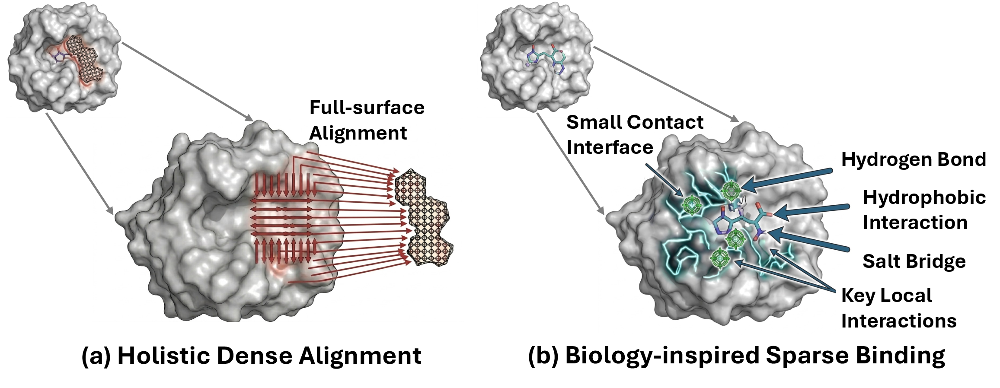
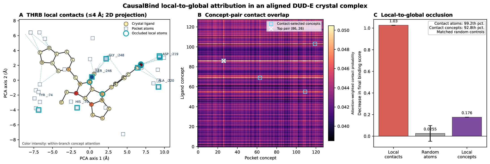

<h1 align="center">CausalBind: Causal Modeling and Learning for Protein-Molecule Virtual Screening [NeurIPS'26 Oral]</h1>

<p align="center">
  <b>Loka Li</b><sup>1</sup>, <b>Jin Tian</b><sup>1</sup>, <b>Kun Zhang</b><sup>1,2</sup><br>
  <sup>1</sup>Mohamed bin Zayed University of Artificial Intelligence    <sup>2</sup>Carnegie Mellon University
</p>

<p align="center">
  
  <a href="LICENSE"></a>
</p>

<p align="center">
  
</p>
<p align="center"><em>
Dense alignment versus sparse binding. (a) Retrieval-based virtual screening methods align every protein feature with every molecule feature in a shared embedding space, entangling binding-relevant signals with nuisance correlations. (b) Real binding is governed by a small contact interface and a handful of key local interactions such as hydrogen bonds, hydrophobic contacts, salt bridges, and π stacking.
</em></p>

This is the official implementation of **CausalBind** (NeurIPS 2026, **Oral**).

## Overview

Protein-molecule virtual screening is increasingly cast as representation learning in a shared embedding space. Existing retrieval methods rely on *dense holistic alignment*, which entangles invariant binding determinants with nuisance correlations and limits transfer to new targets. Biologically, however, binding is governed by **sparse cross-modal interactions**: a small contact interface and a few decisive local interactions rather than the global structures of the protein and molecule.

Because training corpora contain only observed binding pairs, we formalize this prior with a **V-structure causal model under Heckman-style (binder-only) selection** and prove three identifiability results:

1. **Non-identifiability.** Without structural constraints, the latent concepts of interacting proteins and molecules and their dense interaction are not identifiable.
2. **Component-wise identifiability.** Under a sparse-antichain interaction structure, the concepts and their sparse interactions are identifiable up to trivial equivalences.
3. **Subspace identifiability.** Under a low-rank relaxation, the interaction subspaces are identifiable.

Guided by these results, CausalBind replaces dense holistic interaction with a **structure-constrained concept interaction** inside a scalable dual-tower retrieval framework. A Perceiver-style concept extractor decomposes each modality (pocket structure, molecule structure, and protein sequence) into latent concepts, and a learnable cross-modal mask routes binding evidence through a small number of concept pairs. The causal analysis determines which interaction classes are identifiable under binder-only selection; the model is trained with the contrastive/ranking supervision of retrieval-based methods together with the corresponding structural regularizer.

We provide three implementations, plus an atom-level variant used for interpretability:

| Variant                   | Interaction structure                                                                                             | Theory                        |
| ------------------------- | ----------------------------------------------------------------------------------------------------------------- | ----------------------------- |
| **CausalBind-SP**   | learnable sparse concept-pair mask                                                                                | sparse antichain (Theorem 2)  |
| **CausalBind-LR**   | low-rank factorization of the concept-pair mask                                                                   | low-rank subspace (Theorem 3) |
| **CausalBind-EMB**  | constrained mask applied in the pooled embedding space                                                            | low-rank subspace (Theorem 3) |
| **CausalBind-ATOM** | CausalBind-SP whose concept extractor attends over per-atom tokens, so concepts can be traced to individual atoms | sparse antichain (Theorem 2)  |

## Main Results

Zero-shot virtual screening on DUD-E (102 targets) and LIT-PCBA (15 targets), last checkpoint of each run (Table 1 of the paper). Training uses the LigUnity/HypSeek assay-level corpus with every ChEMBL/BindingDB assay whose target appears in DUD-E, LIT-PCBA, or DEKOIS 2.0 removed, and all retrieval models except S²Drug are trained under the same pipeline.

| Method                    |   DUD-E AUROC   |  DUD-E BEDROC  |   DUD-E EF@1%   | LIT-PCBA AUROC | LIT-PCBA BEDROC | LIT-PCBA EF@1% |
| ------------------------- | :-------------: | :-------------: | :-------------: | :-------------: | :-------------: | :------------: |
| DrugCLIP                  |      0.809      |      0.505      |      31.89      |      0.572      |      0.062      |      5.51      |
| DrugHash                  |      0.837      |      0.572      |      37.18      |      0.546      |      0.071      |      6.14      |
| LigUnity                  |      0.897      |      0.674      |      44.20      |      0.599      |      0.075      |      6.50      |
| HypSeek                   |      0.909      |      0.605      |      37.83      |      0.603      |      0.061      |      4.62      |
| S²Drug†                 |      0.925      | **0.793** |      43.06      |      0.582      |      0.087      |      7.38      |
| **CausalBind-SP**   |      0.935      |      0.744      |      47.69      | **0.639** |      0.097      |      8.56      |
| **CausalBind-LR**   |      0.935      |      0.704      |      44.87      |      0.632      | **0.103** |      8.84      |
| **CausalBind-EMB**  |      0.939      |      0.754      |      48.56      |      0.636      |      0.102      | **9.60** |
| **CausalBind-ATOM** | **0.943** |      0.768      | **49.66** |      0.621      |      0.079      |      6.25      |

† Paper-reported results, not reproduced in our pipeline.

The paper additionally reports multi-seed ablations, hyperparameter and mask-structure (antichain / effective-rank) analyses, out-of-distribution evaluation on DEKOIS 2.0, affinity ranking on Merck-FEP, and an interpretability case study; see [Analyses](#analyses) for the corresponding tools.

## Repository Structure

```
CausalBind/
├── unimol/                       # model, loss, task and data code (Uni-Core plugin)
│   ├── models/
│   │   ├── causal_modules.py                   # concept extractor, sparse / low-rank mask, pooler
│   │   ├── causal_three_hybrid_v2.py           # CausalBind-SP and CausalBind-LR
│   │   ├── causal_three_hybrid.py              # CausalBind-EMB
│   │   ├── causal_three_hybrid_v2_atomattn.py  # CausalBind-ATOM
│   │   └── three_hybrid_model_frozen.py        # reproduced HypSeek baseline
│   ├── losses/three_hybrid_loss.py
│   └── tasks/{train_task,test_task}.py
├── scripts/
│   ├── quick_start.sh            # download released checkpoints and reproduce Table 1
│   ├── download_data.sh          # pretrained backbones, training data, test benchmarks
│   ├── variant_config.sh         # configuration of every variant reported in the paper
│   ├── train.sh                  # 4-GPU training
│   ├── test.sh                   # DUD-E / LIT-PCBA / DEKOIS / FEP evaluation
│   └── interpret.sh              # local-to-global interpretability case study
├── tools/
│   ├── analyze_antichain.py      # antichain violations of the learned masks (Table 3)
│   ├── analyze_mask.py           # sparsity and effective-rank statistics of the masks
│   ├── dekois_ood.py             # target- and scaffold-level OOD splits on DEKOIS 2.0
│   ├── export_checkpoint.py      # compact (weights-only, fp16) inference checkpoints
│   ├── summarize_results.py      # summary table of the evaluation logs
│   └── interpret_local_binding.py
├── vocab/                        # Uni-Mol dictionaries
├── DATA.md                       # data sources, licenses, layout, and train/test protocol
└── environment.yml
```

## Installation

```bash
git clone https://github.com/lokali/CausalBind.git
cd CausalBind

conda env create -f environment.yml
conda activate causalbind

# Uni-Core
git clone https://github.com/dptech-corp/Uni-Core.git
cd Uni-Core && python setup.py install && cd ..
```

The code was developed and tested with Python 3.11, PyTorch 2.7 (CUDA 11.8), and NVIDIA A100 GPUs.

## Data

All data are public third-party resources released with LigUnity; please follow their original licenses. [DATA.md](DATA.md) lists every source, the expected directory layout, and the train/test protocol.

```bash
bash scripts/download_data.sh pretrain   # Uni-Mol encoders + ESM-2 (35M)
bash scripts/download_data.sh train      # LigUnity training corpus (figshare)
bash scripts/download_data.sh test       # CASF and benchmark index files, DEKOIS 2.0;
                                         # prints instructions for DUD-E and LIT-PCBA (Google Drive)
```

## Quick Start: Reproduce Table 1 with Released Checkpoints

We release the trained checkpoints of the four CausalBind variants (the last checkpoint of each run, model weights only, 571 MB each for SP/LR/ATOM). After installing the environment and downloading the pretrained backbones and test benchmarks (see [Data](#data)), one command downloads the checkpoints and evaluates them on DUD-E and LIT-PCBA on a single GPU:

```bash
bash scripts/quick_start.sh              # all variants: sp lr emb atom
bash scripts/quick_start.sh sp           # or a subset
```

The checkpoints are saved to `checkpoints/`, the logs to `results/quick_start/<variant>/{DUDE,PCBA}.log`, and the script finishes by printing a summary of the results reported in Table 1:

```
Method            | DUD-E AUROC / BEDROC / EF@1%   | LIT-PCBA AUROC / BEDROC / EF@1%
------------------------------------------------------------------------------------
CausalBind-SP     | 0.935 / 0.744 / 47.69          | 0.639 / 0.097 / 8.56
CausalBind-LR     | 0.935 / 0.704 / 44.87          | 0.632 / 0.103 / 8.84
CausalBind-ATOM   | 0.943 / 0.768 / 49.66          | 0.621 / 0.079 / 6.25
```

| Checkpoint             | Variant         |  Size  | Download                                                                     |
| ---------------------- | --------------- | :----: | ---------------------------------------------------------------------------- |
| `causalbind_sp.pt`   | CausalBind-SP   | 571 MB | [GitHub release v1.0](https://github.com/lokali/CausalBind/releases/tag/v1.0) |
| `causalbind_lr.pt`   | CausalBind-LR   | 571 MB | [GitHub release v1.0](https://github.com/lokali/CausalBind/releases/tag/v1.0) |
| `causalbind_emb.pt`  | CausalBind-EMB  |   –   | [GitHub release v1.0](https://github.com/lokali/CausalBind/releases/tag/v1.0) |
| `causalbind_atom.pt` | CausalBind-ATOM | 571 MB | [GitHub release v1.0](https://github.com/lokali/CausalBind/releases/tag/v1.0) |

To evaluate a single checkpoint directly: `bash scripts/test.sh <variant> <DUDE|PCBA> checkpoints/causalbind_<variant>.pt <results_dir>`. Your own training checkpoints can be exported to the same compact format with `python tools/export_checkpoint.py <checkpoint_last.pt> <output.pt> --variant <variant>`.

## Training

Each run trains for 50 epochs on 4 GPUs with CASF-2016 as the validation set. The variant name selects the configuration reported in the paper.

```bash
bash scripts/train.sh sp       # CausalBind-SP
bash scripts/train.sh lr       # CausalBind-LR
bash scripts/train.sh emb      # CausalBind-EMB
bash scripts/train.sh atom     # CausalBind-ATOM
bash scripts/train.sh hypseek  # reproduced HypSeek baseline
```

Usage: `bash scripts/train.sh <variant> [save_root=./save] [seed=1]`. Checkpoints are written to `<save_root>/causalbind_<variant>_seed<seed>/savedir/` and the training log to `<save_root>/train_log/`. Set `N_GPU` and `MASTER_PORT` to change the number of GPUs or the rendezvous port.

The configurations in [`scripts/variant_config.sh`](scripts/variant_config.sh) are:

| Variant  | Architecture                        |  K  | d_c | Perceiver layers | λ_spa | Mask                     |
| -------- | ----------------------------------- | :-: | :--: | :--------------: | :----: | ------------------------ |
| `sp`   | `causal_three_hybrid_v2`          | 128 | 1024 |        4        |  1e-4  | sparse (`tanh_plus_1`) |
| `lr`   | `causal_three_hybrid_v2`          | 64 | 1024 |        4        |  1e-4  | `low_rank`, rank 1     |
| `emb`  | `causal_three_hybrid_v1`          | 64 | 256 |        4        |  1e-2  | pooled-embedding mask    |
| `atom` | `causal_three_hybrid_v2_atomattn` | 128 | 1024 |        4        |  1e-4  | sparse (`tanh_plus_1`) |

All variants use a hard-gate threshold of 0.5 (`--sparsity-threshold 0.5`). Please run the variants through `scripts/train.sh` and `scripts/test.sh`, since the argument defaults in the model files differ from the paper configuration.

## Evaluation

The paper reports the last checkpoint of each run. Evaluation runs on a single GPU.

```bash
CKPT=save/causalbind_sp_seed1/savedir/checkpoint_last.pt
bash scripts/test.sh sp DUDE $CKPT results/sp
bash scripts/test.sh sp PCBA $CKPT results/sp
```

Usage: `bash scripts/test.sh <variant> <DUDE|PCBA|DEKOIS|FEP> <checkpoint> <results_dir>`. The log prints per-target metrics and ends with the macro-averaged `auc mean`, `bedroc mean`, and `ef <cutoff> mean` at the 0.5%, 1%, 2%, and 5% cutoffs; the paper reports `ef 0.01` as EF@1%.

## Analyses

**Mask structure (Table 3).** Antichain violations, hard-zero rate, and effective rank of the learned cross-modal masks:

```bash
python tools/analyze_antichain.py save/causalbind_sp_seed1/savedir/checkpoint_last.pt
python tools/analyze_mask.py save/causalbind_sp_seed1/savedir
```

**Out-of-distribution evaluation on DEKOIS 2.0 (App. A6.3).** The target-level split keeps the 9 DEKOIS targets whose UniProt IDs are absent from all training sources; the scaffold-level split further keeps the test pairs whose Bemis–Murcko scaffolds are absent from all 439,639 training molecules (6 targets with at least 5 such actives).

```bash
python tools/dekois_ood.py make-subset --out test_datasets/DEKOIS_OOD
TEST_DATA_ROOT=test_datasets/DEKOIS_OOD bash scripts/test.sh sp DEKOIS $CKPT results/sp_dekois  # target-level
python tools/dekois_ood.py scaffold --subset test_datasets/DEKOIS_OOD \
    --results CausalBind-SP=results/sp_dekois/DEKOIS                                          # scaffold-level
```

**Interpretability (App. A6.4).** CausalBind-ATOM lets each learned concept be traced to individual atoms. For a DUD-E crystal complex, the case study identifies the concepts covering the observed ligand–pocket contacts (≤ 4 Å), masks the associated atoms at the concept bottleneck, and compares the drop in the predicted binding score with matched random masks.

```bash
bash scripts/interpret.sh save/causalbind_atom_seed1/savedir/checkpoint_last.pt results/interpret thrb
```

<p align="center">
  
</p>

## Citation

If you find CausalBind useful in your research, please consider citing:

```bibtex
@inproceedings{li2026causalbind,
  title     = {CausalBind: Causal Modeling and Learning for Protein-Molecule Virtual Screening},
  author    = {Li, Loka and Tian, Jin and Zhang, Kun},
  booktitle = {Advances in Neural Information Processing Systems},
  year      = {2026}
}
```

## Acknowledgments

CausalBind builds on a line of open research in AI for drug discovery, and we are grateful to the community for sharing code, data, and models so openly. We especially thank the authors of [**LigUnity**](https://github.com/IDEA-XL/LigUnity) and [**HypSeek**](https://github.com/jianhuiwemi/HypSeek): our implementation extends the HypSeek code base, and our training corpus and benchmark files come from the data resources released by LigUnity. Their open-source contributions made this work possible.

We also thank the developers of [Uni-Mol](https://github.com/deepmodeling/Uni-Mol), [Uni-Core](https://github.com/dptech-corp/Uni-Core), [ESM-2](https://github.com/facebookresearch/esm), [MERU](https://github.com/facebookresearch/meru), and [DrugCLIP](https://github.com/bowen-gao/DrugCLIP), as well as the curators of ChEMBL, BindingDB, PDBbind, DUD-E, LIT-PCBA, DEKOIS 2.0, and the FEP benchmarks.

## License

The CausalBind code is released under the [MIT License](LICENSE). It contains code derived from third-party projects that remain under their own licenses; in particular, the hyperbolic-geometry utilities inherited from MERU (`lorentz.py`, `distributed.py`) are under CC BY-NC 4.0 and restrict commercial use. See [NOTICE](NOTICE) for details. The datasets are not redistributed here and are subject to the terms of their original providers.

## Contact

For questions, please open an issue or contact Loka Li (longkang.li@mbzuai.ac.ae).
